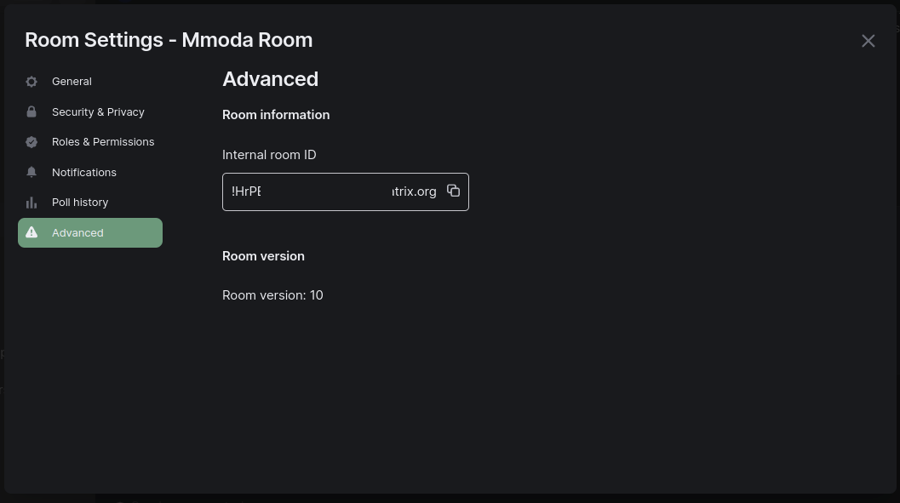

ODA Dispatcher
==========================================

[](https://codecov.io/gh/oda-hub/dispatcher-app)

A flexible python framework to bridge front-end and data-server for scientific online analysis of astrophysical data:

* provides boilerplate code to implement interfaces to specific instrument backends with [plugins](dispatcher-plugins).
* implements interface to [frontend](frontend).
* explains [auth](interfaces.md)

**this repository also contains much of relevant documentations to gluing these levels together**

What's the license?
-------------------

dispatcher-app is distributed under the terms of [The MIT License](LICENSE).

Who's responsible?
-------------------
Andrea Tramacere, Volodymyr Savchenko

Astronomy Department of the University of Geneva, Chemin d'Ecogia 16, CH-1290 Versoix, Switzerland


Jobs updates with messages on matrix
-----------------------------------------------

It is possible to receive update messages regarding the status of the jobs submitted on the mmoda platform. An emailing system is already provided out-of-the-box, provided that a token is used (this contains the user email address to which the updates will be sent, along with a number of other configurations, more details can be found [here](interfaces.md#user-tokens)).

The platform now supports also the sending of messages via the [Matrix](https://matrix.org/) platform, and a dedicated messaging bot (__@mmoda-bot__) is available for sending jobs updates.

All communication over Matrix happens within a **room**: for this reason, in order to receive jobs updates, one must be configured.

[//]: # (Two options are possible:)
[//]: # ()
[//]: # (* _**shared room**_: a room where multiple users can participate.)
[//]: # (* _**direct message room**_: a room where the messages are directly sent and received, to and from a particular user.)
[//]: # (> **NOTE**)
[//]: # (> This feature is not supported yet)

Obviously, an account on the matrix platform is necessary. In addition, a number of configuration steps are necessary, either on the **_token_** as well as on the _**matrix user account**_.

For the purpose of this documentation, the matrix client **element** will be used (https://element.io/).

Matrix account configuration
----------------------------

### Configuration of a shared room

Within the element client:
* Create a dedicated room 
<br/>
<div align="center">


</div>
<br clear="left"/>

* Invite the __@mmoda-bot__ user to the room created in the previous step
<div align="center">


</div>
<br clear="left"/>

* __@mmoda-bot__ will then have to join the room (as stated within the [client-server-api](https://spec.matrix.org/latest/client-server-api/#room-membership)), and this will be automatically performed by the dispatcher.

Once a job is started, and the previous steps have been followed, the __@mmoda-bot__ will send updates regarding the state of the job.

An example of a message can be seen the image below:


### Token specific configuration

Within the token, some configuration are user-specific (and mandatory), whereas others are optional, and if not provided, a set of default values will be available within the dispatcher configuration:

* `mxroomid` (user-specific): id of the room to where the messages should be sent. Using the element client, this can be found within the settings of the room itself, as visualized within the image below:

  For add or update the token with the id of a certain room, the CLI from the `oda-api` provide a dedicated command:
    ```bash
    oda-api token -s SECRET_KEY --matrix-room-id test_room_id:matrix.org
    ```
  
  Where `SECRET_KEY` refers to the secret key used to encode and decode the token within the mmoda platform.     

  It is also possible to disable the reception of messages via matrix with the following command:
    ```bash
    oda-api token -s SECRET_KEY --disable-matrix
    ```
    
For more detailed information regarding the other options, a dedicated section is available [here](interfaces.md#user-tokens).   

